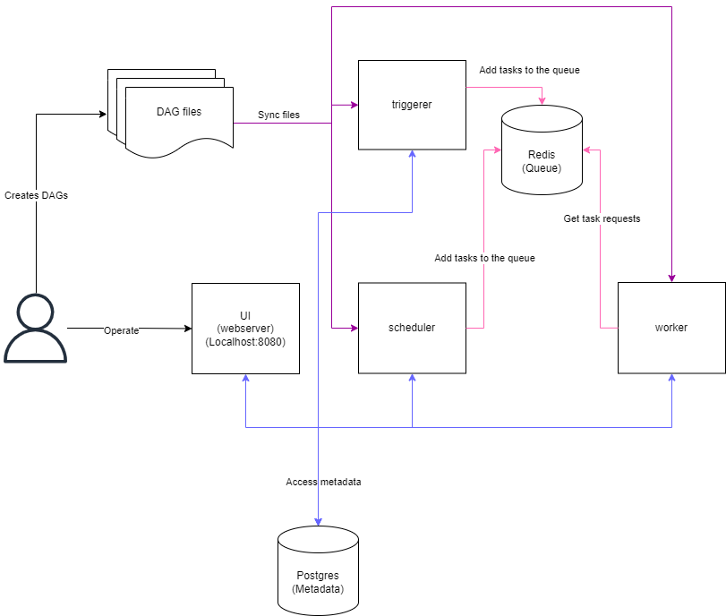
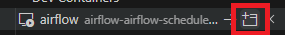
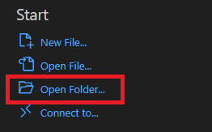

# Airflow

This repository contains an Airflow environment with a sample DAG.

## Requirements

- [Docker](https://docs.docker.com/get-docker/)
- [Docker compose](https://docs.docker.com/compose/install/)

## Usage

### Getting started

1. Make sure you have all requirements up and running 
2. On the `root` folder run `docker compose up` command. This will startup all services describled on the `compose.yml` file.

### Docker Compose

This docker compose contains the following service definitions: 

- postgres - Postgres database used by airflow to store metadada
- redis - Radis broker that forwards messages from scheduler to worker.
- airflow-webserver - An Airflow web interface exposed at `http://localhost:8080`. The default account has the login `airflow` and the password `airflow`.
- airflow-scheduler - The scheduler monitors all tasks and DAGs, then triggers the task instances once their dependencies are complete.
- airflow-worker - The worker that executes the tasks given by the scheduler.
- airflow-triggerer - The triggerer runs an event loop for deferrable tasks.
- airflow-init - The initialization service.

Optionally, you can enable flower by adding `--profile flower` option, e.g. `docker compose --profile flower up`, or by explicitly specifying it on the command line e.g. `docker compose up flower`.

- flower - Flower app for monitoring the environment. It is available at `http://localhost:5555`. 

Optionally, you can create an debug container by adding `--profile debug` option, e.g. `docker compose --profile debug up`, or by explicitly specifying it on the command line e.g. `docker compose up debug`.

- airflow-cli - An container used to debug airflow. 

All these services allow you to run Airflow with CeleryExecutor. For more information, see Architecture Overview.

### Architectural Flow

1. A developer creates Directed Acyclic Graphs (DAGs) and stores them in the `dags` folder.
2. The scheduler scans the `dags` directory to detect and register the DAGs in the metadata database.
3. The scheduler places task execution requests into the message queue.
4. Workers retrieve tasks from the message queue, execute them, and update the execution status in the metadata database.
5. The web server fetches task information from the metadata database, allowing users to monitor progress and view logs.

For more datails please check the links

### Folder structure

Some directories in the container are mounted, which means that their contents are synchronized between your computer and the container.

- ./dags - you can put your DAG files here.
- ./logs - contains logs from task execution and scheduler.
- ./plugins - you can put your custom plugins here.

## Debug using VSCode

1. Make sure that you have the [Remote Development](https://marketplace.visualstudio.com/items?itemName=ms-vscode-remote.remote-containers) extension installed.
2. Make sure that the containers are running
3. Open the `Remote Explorer` window find the scheduler cointainer and click on `Attach in New Window`

4. On the new window click on `Open folder` and open the dag folder located at `/opt/airflow/dags/`

5. Make sure that the [python extension](https://marketplace.visualstudio.com/items?itemName=ms-python.python) is intalled
6. Open the `debug` window and choose the `Python: Dag Debugger` profile
7. Press `F5` and the debugger should start

To change the `dag` filte that the debbuger will start, go to the `/.vscode/launch.json` file and change the 3rd argument to the dag name that you want to debug. 

## Links 

[Airflow Setup Documentation](https://airflow.apache.org/docs/apache-airflow/stable/howto/docker-compose/index.html)
[DAGs best practices](https://airflow.apache.org/docs/apache-airflow/stable/best-practices.html)
[Airflow architecture overview](https://airflow.apache.org/docs/apache-airflow/stable/core-concepts/overview.html)