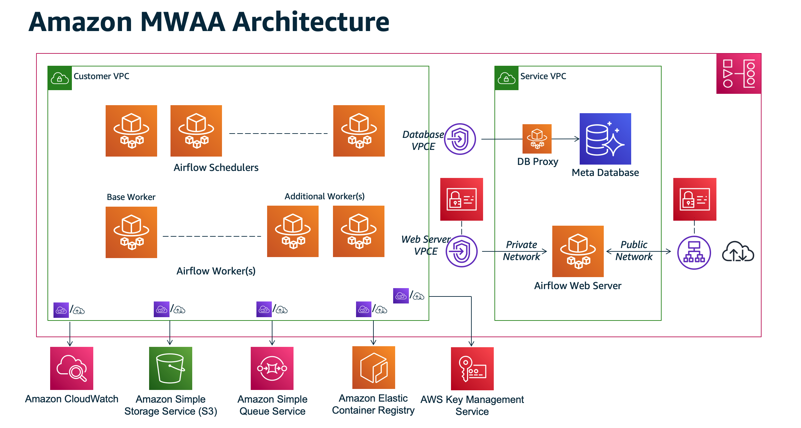
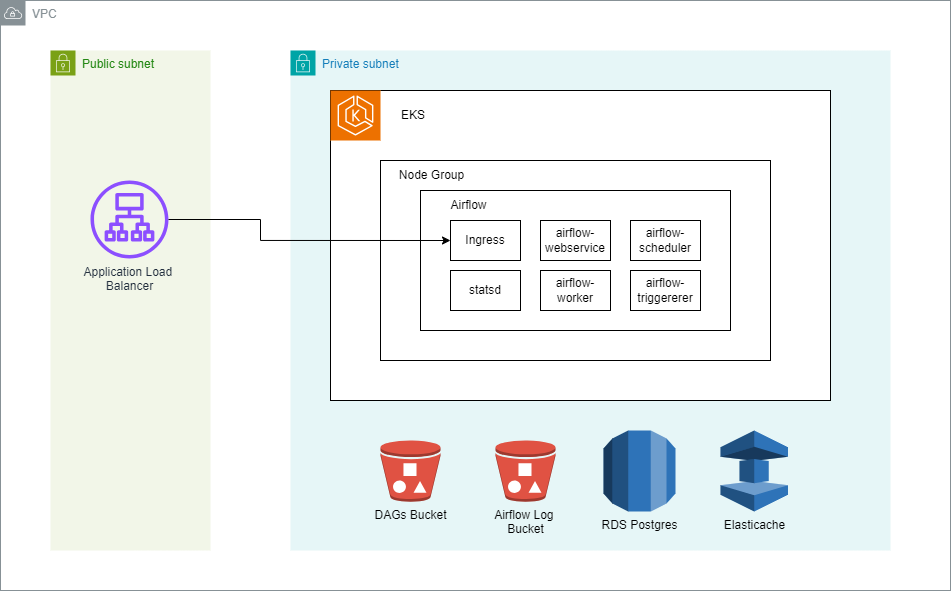

# Architecture Decision Record: Choosing a cloud achitecture for airflow

## Status

Accepted

## Context

We aim to deploy an Airflow infrastructure on AWS using the same resources utilized in this project. We have identified two widely adopted approaches in the market: Amazon MWAA, which is a managed solution by AWS, or provisioning Airflow within a Kubernetes cluster in a self-managed manner.

#### Proposal 1: Amazon MWAA 

All of the components contained in the outer box is part of the Amazon MWAA. The Apache Airflow Scheduler and Workers are AWS Fargate (Fargate) containers that connect to the private subnets in the Amazon VPC for your environment. Each environment has its own Apache Airflow metadatabase managed by AWS that is accessible to the Scheduler and Workers Fargate containers via a privately-secured VPC endpoint.

Amazon CloudWatch, Amazon S3, Amazon SQS, Amazon ECR, and AWS KMS are separate from Amazon MWAA and need to be accessible from the Apache Airflow Scheduler(s) and Workers in the Fargate containers.

The Apache Airflow Web server can be accessed either over the Internet by selecting the Public network Apache Airflow access mode, or within your VPC by selecting the Private network Apache Airflow access mode. In both cases, access for your Apache Airflow users is controlled by the access control policy you define in AWS Identity and Access Management (IAM).

Our structure uses Redis as queue but MWAA uses AWS SQS service. 

##### Advantages:

- Simplicity: Simplified setup and maintenance since AWS manages the infrastructure.
- AWS Integration: Native integration with other AWS services like S3, CloudWatch, and IAM.
- Automatic Scalability: Scalability is managed by AWS, adjusting resources according to the load.

##### Disadvantages:

- Limited Flexibility: Less control over customization and infrastructure.
- Cost: It can be more expensive, especially for smaller workloads or testing environments.
- Version Dependency: You're limited to the Airflow versions supported by AWS.

##### Reference: 
- [What Is Amazon Managed Workflows for Apache Airflow?](https://docs.aws.amazon.com/mwaa/latest/userguide/what-is-mwaa.html)
- [Metrics for Amazon MWAA](https://docs.aws.amazon.com/mwaa/latest/userguide/accessing-metrics-cw-container-queue-db.html)
- [How to Setup a Local MWAA Development Environment](https://medium.com/codex/how-to-setup-a-local-mwaa-development-environment-92e4e7557ecb)

#### Proposal 2: Self-managed airflow with eks

We can use aws redis managed service (Elasticache) or we can host a self-managed redis inside EKS 

##### Advantages:

- Flexibility: Full control over environment configuration and customization.
- Scalability: Ability to customize scalability and resource sizing.
- Multi-Cloud: Can be adapted for a multi-cloud environment if needed.

##### Disadvantages:

- Complexity: Requires more technical knowledge and time to set up and maintain.
- Maintenance: You need to manage updates, security, and monitoring.
- Cost: Depending on the configuration, costs can be higher, especially if not optimized.

##### Reference: 

- [Self-managed Apache Airflow deployment on Amazon EKS](https://awslabs.github.io/data-on-eks/docs/blueprints/job-schedulers/self-managed-airflow)

## Rationale

We have chosen a MWAA because:

1. These approaches are suitable for different needs. MWAA is ideal for those who prioritize simplicity and easy integration with AWS, while EKS offers greater control and flexibility for complex or customized environments.

2. Our initial goal is to experience low data volume. 

3. Migrating from MWAA to a self-hosted solution is not complex.

4. Starting with MWAA will allow us to focus on delivering value to our customers. As our workload increases, we can plan to migrate to a self-hosted solution to be more more flexible and potentially cost-effective.

## Consequences

By choosing Amazon MWAA, we acknowledge that we'll be tied to the AWS ecosystem. In the medium to long term, this may necessitate a migration to a self-hosted solution. 

However, we believe the benefits of using Amazon MWAA outweigh the potential drawbacks, allowing our team to concentrate on delivering value to our customers.